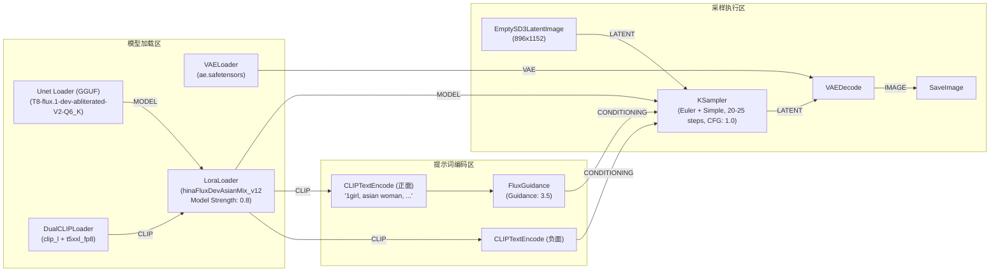

# FLUX 底模 (MYHuman & Abliterated-V2 GGUF) 与 8 款亚洲人像 LoRA 兼容性选型指南

> **适用环境**：NVIDIA RTX 4060 Ti (16GB VRAM) / 32GB RAM / ComfyUI  
> **最后更新**：2026-09-08  
> **归档位置**：`docs/flux_myhuman_and_asian_lora_guide.md` & `.agent/wiki/flux_myhuman_and_asian_lora_guide.md`

---

## 目录
1. [核心基模选型分析（MYHuman vs flux.1-dev-abliterated-V2-GGUF）](#一核心基模选型分析)
2. [LoRA 架构兼容性总揽法则](#二lora-架构兼容性总揽法则)
3. [8 款 Civitai 亚洲人像 LoRA 深度评测与清单](#三8-款-civitai-亚洲人像-lora-深度评测与清单)
4. [GGUF 架构在 ComfyUI 中的实操拓扑与避坑指南](#四gguf-架构在-comfyui-中的实操拓扑与避坑指南)

---

## 一、核心基模选型分析

### 1. 实际使用模型：t8star / flux.1-dev-abliterated-V2-GGUF
* **HuggingFace 仓库**：[t8star/flux.1-dev-abliterated-V2-GGUF](https://huggingface.co/t8star/flux.1-dev-abliterated-V2-GGUF/tree/main)
* **模型本质**：**FLUX.1 [dev] 原生 12B DiT 架构**。
* **什么是 Abliterated-V2（定向消融/解锁约束）？**
  - 原版 FLUX.1 [dev] 内部包含较严格的安全对齐与拒绝机制（Refusal Vectors），在渲染某些敏感人体解剖结构、特定着装、动态姿势时，容易出现画面灰度劣化、模糊或局部崩坏。
  - **Abliterated-V2** 采用权重正交投影（Abliteration）技术移除了阻碍生成的安全干预向量，**100% 保持了原本的美学、构图与细节表现力**，同时显著增强了提示词遵循度与真实人像肢体自然度。
* **仓库内 3 个量化文件深度选型（针对 RTX 4060 Ti 16GB）**：

| 文件名 | 量化精度 | 体积 | 4060 Ti (16G) 评级 | 评测结论 |
| :--- | :---: | :---: | :---: | :--- |
| **`T8-flux.1-dev-abliterated-V2-GGUF-Q6_K.gguf`** | Q6_K | **10.1 GB** | ⭐️⭐️⭐️⭐️⭐️ **最佳黄金甜点** | **强烈推荐首选**。画质接近 FP16 无损（99.5%+），10.1GB 常驻显存，给 T5 调度留出 5G+ 安全余量，全程纯显存满速推理，绝不爆显存。 |
| **`T8-flux.1-dev-abliterated-V2-GGUF-Q4_K_M.gguf`** | Q4_K_M | **6.94 GB** | ⭐️⭐️⭐️⭐️ **备选** | 极端节省显存，适合同时挂载 ControlNet、FaceID/PuLID 等多重重型节点的超大工作流。 |
| **`T8-flux.1-dev-abliterated-V2-GGUF-Q8_0.gguf`** | Q8_0 | **12.7 GB** | ⭐️⭐️⭐️ 不推荐 | 12.7G 加上 VAE 和 T5 调度，会瞬时撑破 16G 显存溢出到共享内存，引起轻微掉速。 |

* **Q6_K 官方直链下载**：
  `https://huggingface.co/t8star/flux.1-dev-abliterated-V2-GGUF/resolve/main/T8-flux.1-dev-abliterated-V2-GGUF-Q6_K.gguf`

---

### 2. 补充参考：MYHuman-墨幽随拍-Flux (Civitai 775057)
* 若需要追求“开箱即用”的小红书生活随拍、胶片抓拍感，可选用该微调底模的 **FP8 版本** (`myhumanFlux_myh13Fp8.safetensors`, 11.1 GB)。

---

## 二、LoRA 架构兼容性总揽法则

> [!IMPORTANT]
> **基底判定**：由于 `t8star/flux.1-dev-abliterated-V2-GGUF` 的底层仍然是标准的 **FLUX.1 [dev]**，因此所有为 **Flux.1 Dev** 训练的 LoRA **全部完美通用**！
> 
> * **FLUX.1 [dev] 兼容 LoRA**：可直接挂载。且由于 Abliterated 移除了原版的过度干预，人像 LoRA 在此底模上的特征还原度通常比官方原版 Dev 更自然。
> * **FLUX.1 [schnell] 专属 LoRA**：由于蒸馏步数与 Guidance 机制不同，易导致过曝，不推荐混用。
> * **FLUX.2 [Klein] 架构 LoRA**：4B/9B 异构网络，**绝对无法加载**。

---

## 三、8 款 Civitai 亚洲人像 LoRA 深度评测与清单

### 1. 兼容性快速速查表（基于 flux.1-dev-abliterated-V2）

| 模型 ID | 模型名称 | 原始底模 | 兼容本模型? | 推荐版本/文件名 | 体积 | 触发词 |
| :--- | :--- | :--- | :---: | :--- | :--- | :--- |
| **706111** | [Flux1] Asian Mix Lora - Krea/Dev | Flux.1 D / Krea |  **完美兼容 (首选)** | `v12.0-fp16` (`hinaFluxDevAsianMix_v12`) | 352.9 MB | `asian woman` |
| **1976641** | Thailand Asian Flux Character LORA | Flux.1 D (多模态) |  **兼容(需选Dev版)** | `FLUX1Dev` (`flux-ppango`) | 37.9 MB | `ppango` |
| **2192611** | Thailand Asian Multi-Model Character | Flux.1 D (多模态) |  **兼容(需选Dev版)** | `FLUX1Dev` (`Thai_shorty_F1D`) | 36.6 MB | `sh0r1y_1ha1` |
| **715862** | [Flux1-schnell] Asian Mix Lora / Lokr | Flux.1 S | ⚠️ **需 Schnell** | `v25 - Lokr` | 158.7 MB | `asian woman` |
| **2563631** | [Flux.2 Klein 9b] Asian Mix Lora | Flux.2 Klein 9B | ❌ **不兼容** | `v1.4` | 158.0 MB | `asian woman` |
| **2532920** | NexBlend Asian Realistic LoRA | Flux.2 Klein 9B | ❌ **不兼容** | `Flux 2 Klein 9B` | 158.0 MB | 无 |
| **2423116** | [Flux.2 Klein 4b] Asian Mix Lora | Flux.2 Klein 4B | ❌ **不兼容** | `4.0` | 176.3 MB | 无 |
| **2066519** | Asian Lora023 | SDXL 1.0 (标签混淆) | ❌ **不推荐** | `v1.0` | 157.4 MB | 无 |

---

### 2. 兼容模型的直链下载与配置

#### 【首选推荐】ID: 706111 — [Flux1] Asian Mix Lora - Krea/Dev
* **Civitai 页面**：[706111](https://civitai.com/models/706111/flux1-asian-mix-lora-kreadev)
* **特色**：Hina 出品的顶级亚洲混血脸调校。配合 Abliterated-V2 底模时，能完美中和西方特征，呈现通透精致的东亚女性面容。
* **推荐下载版本**：**`v12.0-fp16`**（专为 Dev 打造）
* **直链下载**：[点击下载 v12.0-fp16 (352.9 MB)](https://civitai.com/api/download/models/1915077?fileId=1813493)
* **建议权重**：`0.7 ~ 1.0`

#### 【特定角色】ID: 1976641 — Thailand Asian Flux Character LORA
* **Civitai 页面**：[1976641](https://civitai.com/models/1976641/thailand-asian-flux-character-lora-sfw-nsfw-multimodal-version)
* **特色**：泰国本土风情女性（Ppango），五官立体，支持 SFW/NSFW。
* **直链下载**：[点击下载 FLUX1Dev 版 (37.9 MB)](https://civitai.com/api/download/models/2237355?fileId=2130229)
* **触发词**：`ppango`

#### 【特定角色】ID: 2192611 — Thailand Asian Multi-Model Character LORA
* **Civitai 页面**：[2192611](https://civitai.com/models/2192611/thailand-asian-multi-model-character-lora-sfw-nsfw-qwen-flux-1-dev-z-image-turbo)
* **特色**：泰国年轻娇小幼态面孔。
* **直链下载**：[点击下载 FLUX1Dev 版 (36.6 MB)](https://civitai.com/api/download/models/2468804?fileId=2357411)
* **触发词**：`sh0r1y_1ha1`

---

## 四、GGUF 架构在 ComfyUI 中的实操拓扑与避坑指南

### 1. 必要环境前置
* 必须在 ComfyUI Manager 中安装自定义插件：**`ComfyUI-GGUF`**（by city96）。

### 2. 文件存放目录
* **GGUF 扩散底模**：
  `ComfyUI/models/unet/T8-flux.1-dev-abliterated-V2-GGUF-Q6_K.gguf`
* **LoRA 存放目录**：
  `ComfyUI/models/loras/hinaFluxDevAsianMix_v12.safetensors`
* **文本编码器 CLIP**：
  `ComfyUI/models/clip/clip_l.safetensors` 与 `ComfyUI/models/clip/t5xxl_fp8_e4m3fn.safetensors`
* **VAE 编解码器**：
  `ComfyUI/models/vae/ae.safetensors`

### 3. GGUF + LoRA 标准工作流连接拓扑

> [!TIP]
> **关于 GGUF 与 LoRA 的兼容机制**：
> `ComfyUI-GGUF` 完美支持把标准 safetensors 格式的 Flux LoRA 接入 `LoraLoader`。节点在对 GGUF 模型进行反量化（Dequantization）运算时，会自动将 LoRA 增量应用到对应权重中，无需对 LoRA 进行任何特殊转换。
