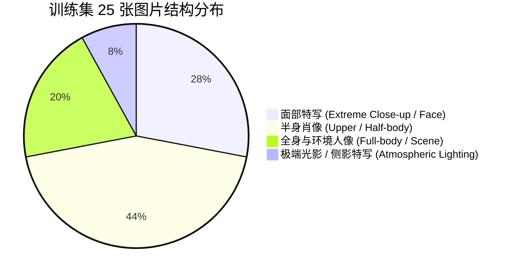

# FLUX + LoRA 虚拟数据集生成方案与提示词全集

本方案旨在指导您使用 **FLUX.1** 本地生成一套高质量、无版权、特征统一的 15~30 张美女数据集，用于微调您自己的专属角色 LoRA。

---

## 一、 可行性深度评估：用 AI 生成训练集可行吗？

**结论：完全可行，且是当前主流甚至最推荐的高端炼丹方案（Synthetic Data Distillation）。**

### 1. 优势
- **画质无瑕疵**：真实照片往往存在手机对焦模糊、噪点过多、暗光抹平皮肤细节、背景水印等问题；而 FLUX 1024x1024 原生生成的图片毛孔、发丝、眼神光皆为顶级水平。
- **构图与景别完全可控**：您可以精准控制特写、半身、全身、仰角、俯角的配比，无需受限于现实中有限的照片库存。
- **100% 隐私安全**：完全纯属虚构角色，无肖像权争议。

### 2. 核心注意事项（避坑指南）
- **警惕“AI 塑料感”**：FLUX 的 Guidance 如果开得太高（> 4.5），人脸容易呈现过于油腻平滑的“芭比娃娃感”。训练集必须保留真实皮肤纹理（pores, fine peach fuzz, subtle skin texture）。
- **人脸漂移控制**：因为还没有训练出专属 LoRA，单纯用 Prompt 生图可能会有些微脸型漂移。**解决方案**：
  1. 固定一个统一的基础描述段落（例如固定骨相、眼型、唇形）；
  2. 可以加载一个现成的高分亚洲女性 LoRA（如 Civitai 上的 Asian Beauty LoRA）以 `0.6~0.8` 权重作为锚点辅助出图；
  3. 生成 50~60 张，人工挑选五官最一致、最耐看的 20~25 张进入训练集。

---

## 二、 提示词语言选择：中文还是英文？

**结论：强烈推荐使用【英文自然语言】（English Natural Language）。**

| 评估维度 | 英文提示词 (English) | 中文提示词 (Chinese) |
| :--- | :--- | :--- |
| **底层编码器匹配度** | **完美**。FLUX 核心是 T5-XXL + CLIP-L，预训练对齐数据 95% 以上为英文 BLIP/LLaVA 详细标注。 | **较弱**。T5 虽然有多语言能力，但对中文摄影/美术专业词汇理解粗糙。 |
| **光影与材质激发** | `subsurface scattering`, `rim lighting`, `catchlight`, `kodak portra` 能精准生效。 | 对应中文词（如“次表面散射”、“边缘光”）常被模型忽略或误读。 |
| **生图稳定性** | 语法越规范、描述越自然，出图细节越饱满。 | 易出现语义断层、漏解某些修饰定语。 |

> [!TIP]
> **最佳实践**：提示词一律写英文详细自然段；如果灵感来自中文，可以使用您本机的 **Qwen3** 先写中文设定，再翻译润色为摄影级英文。

---

## 三、 训练集黄金配比规范（共 25 张）

为了让训练出来的 LoRA 既能精准还原面部，又具备极强的换装与换景泛化能力，建议生成并挑选 **25 张**，配比如下：



- **统一面部基底锚词（Core Anchor）**：
  `A gorgeous 21-year-old East Asian young woman, natural double eyelids, gentle almond-shaped dark brown eyes, soft high bridge nose, delicate jawline, healthy radiant skin with subtle natural texture, glossy lips.`

---

## 四、 25 组分类提示词库（复制即用）

所有提示词均已针对 FLUX 的 T5 文本编码器进行句式优化，分为特写、半身、全身及氛围光影四大板块。

### 模块 A：面部特写与极致细节（7组）

#### 01. 阳光室内自然正面特写 (Classic Beauty Headshot)
```text
A close-up beauty portrait of a gorgeous 21-year-old East Asian young woman, natural double eyelids, gentle almond-shaped dark brown eyes, soft high bridge nose, delicate jawline, healthy radiant skin with subtle natural texture. Soft neutral daylight illuminating her face from a nearby window, gentle catchlights in her eyes, neutral calm expression, straight dark hair falling softly around her shoulders. Shot on 85mm f/1.8 lens, sharp focus on eyes, soft creamy background blur.
```

#### 02. 45度微侧微笑特写 (45-degree Angle Gentle Smile)
```text
A close-up three-quarter angle portrait of a gorgeous 21-year-old East Asian young woman, looking towards the camera with a gentle warm smile. Natural skin pores, soft cheek flush, parted glossy lips showing slightly visible teeth. Hair styled in a loose low ponytail with wispy bangs framing her face. Studio softbox lighting creating a flattering rim light along her jawline. 105mm macro lens, shallow depth of field.
```

#### 03. 侧脸轮廓剪影感 (Profile View & Jawline)
```text
A refined profile shot of a gorgeous 21-year-old East Asian woman looking to the side, showcasing her elegant jawline and delicate nose bridge. Soft hair strands tucked behind her ear, subtle stud earring. Warm diffused afternoon sunlight glancing across her cheek, highlighting the natural peach fuzz and porcelain skin texture. Minimalist aesthetic, muted warm beige background.
```

#### 04. 户外自然风吹发特写 (Outdoor Wind-blown Candid)
```text
An outdoor tight portrait of a gorgeous 21-year-old East Asian woman in a park, breeze gently blowing strands of hair across her cheek. She looks softly into the lens with thoughtful dark brown eyes. Dappled sunlight filtering through autumn leaves, creating soft golden bokeh circles in the background. Natural authentic skin without heavy makeup.
```

#### 05. 晨光素颜感特写 (Morning Clean Aesthetic)
```text
A close-up intimate portrait of a gorgeous 21-year-old East Asian young woman in soft morning light, sitting in bed. Bare-face aesthetic, fresh dewy skin, sleepy gentle gaze, relaxed expression. Messy casual dark hair, cozy white cotton duvet visible near the bottom of frame. High dynamic range, soft organic tones.
```

#### 06. 仰角复古胶片特写 (Low Angle Film Aesthetic)
```text
A low-angle close-up portrait of a gorgeous 21-year-old East Asian woman tilting her head slightly back against a clear blue sky. Direct crisp sunlight carving gentle shadows beneath her chin, natural skin tone, slight wind in her hair. 35mm film photograph aesthetic, subtle grain, vivid natural colors.
```

#### 07. 情绪感微表情特写 (Expressive Candid Mood)
```text
A close-up portrait capturing a candid moment of a gorgeous 21-year-old East Asian woman laughing softly with hand lightly touching her chin. Genuine eye smile, expressive crinkles at the outer eyes, joyful aura. Soft diffused indoor coffee shop lighting, warm cozy ambience.
```

---

### 模块 B：半身与多场景生活肖像（11组）

#### 08. 咖啡馆窗边针织衫 (Cafe Window Knitted Sweater)
```text
A medium shot of a gorgeous 21-year-old East Asian young woman sitting at a rustic wooden cafe table, wearing an oversized beige cashmere knit sweater. Holding a warm ceramic coffee mug with both hands, steam rising gently. She gazes out the rain-streaked window with a relaxed expression. Ambient warm indoor cafe lights in the background, cinematic bokeh, 50mm f/1.4 lens.
```

#### 09. 白衬衫简约职场/日常 (Minimalist White Shirt)
```text
A half-body portrait of a gorgeous 21-year-old East Asian woman standing against a clean light grey studio backdrop. She is wearing a relaxed crisp white button-up shirt with rolled-up sleeves. Modern minimalist elegance, confident poised posture, hands tucked in navy trousers pockets. Soft studio dual-light setup.
```

#### 10. 书店文艺阅读 (Bookstore Intellectual Mood)
```text
A medium portrait of a gorgeous 21-year-old East Asian woman leaning against wooden bookshelves in an old library. Wearing thin gold-rimmed glasses and a dark green cardigan over a white tee. Holding an open vintage hardcover book, eyes cast downward in calm concentration. Warm tungsten lighting from brass library lamps.
```

#### 11. 城市街头休闲风 (Urban Street Casual)
```text
A waist-up street style photo of a gorgeous 21-year-old East Asian woman walking along a modern city sidewalk in Tokyo. Wearing a tailored black leather jacket over a grey hoodie, carrying a minimalist tote bag. Daytime overcast diffuse lighting, modern glass skyscrapers softly blurred in the background, candid motion feel.
```

#### 12. 居家厨房日常 (Cozy Kitchen Lifestyle)
```text
A half-body lifestyle photograph of a gorgeous 21-year-old East Asian woman in a bright modern kitchen, wearing an oversized striped boyfriend shirt. She is reaching for a glass in the upper cabinet, turning her head back toward the camera with a playful smile. Morning sun streaming through the window, clean scandinavian interior design.
```

#### 13. 美术馆/画廊优雅静思 (Art Gallery Poise)
```text
A medium shot of a gorgeous 21-year-old East Asian woman standing in a spacious modern art gallery, viewing a large minimalist canvas. She is wearing a sleek sleeveless black turtleneck dress, hair pinned up into an effortless chignon. Architectural spotlighting creating soft chiaroscuro contrast.
```

#### 14. 连帽卫衣运动休闲 (Athleisure Hooded Look)
```text
A waist-up portrait of a gorgeous 21-year-old East Asian woman in an athletic grey cropped hoodie, athletic high ponytail. She is resting on a running track bench, drinking from a sports water bottle, glowing slightly with healthy post-workout vitality. Crisp afternoon outdoor light.
```

#### 15. 春日樱花漫步 (Spring Blossom Portrait)
```text
A medium shot of a gorgeous 21-year-old East Asian woman standing under blooming pink cherry blossom trees. Wearing a pastel lavender trench coat, one hand gently reaching towards a blossom. Soft diffused pastel tones, dreamy spring atmosphere, petal bokeh in the foreground and background.
```

#### 16. 雨夜霓虹街头 (Rainy Neon Reflections)
```text
A medium portrait of a gorgeous 21-year-old East Asian woman holding a clear vinyl umbrella on a rainy city street at night. Neon signs from nearby shops reflect colorful magenta and cyan hues on the wet pavement and umbrella. She wears a beige trench coat, looking forward with reflective, glowing eyes.
```

#### 17. 居家沙发抱枕慵懒风 (Sofa Lounging Casual)
```text
A half-body shot of a gorgeous 21-year-old East Asian woman curled up on a plush cream-colored sofa, hugging a soft throw pillow. Wearing cozy grey lounge wear, barefoot. Reading a tablet, soft warm floor lamp glowing beside the couch, peaceful evening indoor mood.
```

#### 18. 夏日海边微风 (Summer Coastal Breeze)
```text
A waist-up portrait of a gorgeous 21-year-old East Asian woman standing by the seaside railing at sunset. Wearing a lightweight white linen sundress, sun hat held in hand. Ocean waves splashing in the background, warm golden hour sun bathing her face and shoulders with radiant warm tones.
```

---

### 模块 C：全身与大环境姿态（5组）

#### 19. 城市斑马线街拍全身 (Crosswalk Full-Body Streetwear)
```text
A full-body street photography shot of a gorgeous 21-year-old East Asian woman striding across a city pedestrian crosswalk. Wearing wide-leg high-waisted denim jeans, white sneakers, and a cropped bomber jacket. Dynamic walking pose, hair flowing slightly behind her, full figure in frame from head to toe, sunny afternoon urban scene.
```

#### 20. 现代简约室内全身 (Modern Interior Full-Body)
```text
A full-body fashion lookbook photograph of a gorgeous 21-year-old East Asian woman standing gracefully in a sunlit loft apartment with polished concrete floors. Wearing an emerald green pleated midi skirt and a fitted cream knit top. Relaxed standing posture, natural body proportions, floor-to-ceiling glass windows behind her.
```

#### 21. 公园草坪野餐坐姿 (Picnic Grass Sitting Pose)
```text
A full-body candid shot of a gorgeous 21-year-old East Asian woman sitting cross-legged on a red gingham picnic blanket in a lush green park. Wearing a floral cotton summer dress. Surrounded by a picnic basket and fruit, leaning forward slightly with a joyful laugh. Sunlight dappled across the lawn, wide angle perspective.
```

#### 22. 海滩落日漫步全身 (Beach Sunset Stroll Full-Body)
```text
A full-body long shot of a gorgeous 21-year-old East Asian woman walking barefoot along the wet shoreline at twilight. Holding her sandals in one hand, wearing a flowing terracotta maxi dress that catches the ocean breeze. Wet sand reflecting the orange and purple twilight sky, peaceful cinematic composition.
```

#### 23. 阶梯倚靠时尚全身 (Architectural Steps Full-Body)
```text
A full-body architectural portrait of a gorgeous 21-year-old East Asian woman sitting casually on wide outdoor stone steps of a contemporary museum. Wearing a navy blue tailored blazer over tailored shorts and black loafers. Stylish urban editorial pose, geometric leading lines in the stone architecture.
```

---

### 模块 D：氛围感与极端光影（2组）

#### 24. 逆光剪影黄金时刻 (Golden Hour Rim Light Silhouette)
```text
A cinematic medium portrait of a gorgeous 21-year-old East Asian woman turned half-away from the camera, facing the setting sun. Intense warm golden rim lighting outlining her silhouette, hair glowing like spun gold. Rich lens flare curving across the frame, evocative romantic tone, deep filmic shadows.
```

#### 25. 夜间室内蜡烛氛围感 (Candlelit Low-Key Mood)
```text
A low-key intimate portrait of a gorgeous 21-year-old East Asian woman sitting at a dark wooden dinner table lit solely by candlelight. Warm flickering amber light illuminating one side of her delicate face, leaving the other side in deep soft shadow. High contrast, cinematic noir aesthetic, soft vintage grain.
```

---

## 五、 ComfyUI 实操批量出图流程

1. **工作流选择**：
   直接使用您已调优好的 **FLUX.1-dev / Schnell** 工作流（推荐在 `workflows/v3/` 下运行）。
2. **生图关键参数推荐**：
   - **Resolution（分辨率）**：优先使用 `1024x1024`（正方形）、`896x1152`（竖版人像，推荐半身和全身使用）。
   - **Sampler & Scheduler**：`euler` + `simple` 或 `flowmatch`。
   - **Steps（步数）**：`20 ~ 25` 步（对于 Schnell 用 4~8 步）。
   - **CFG / Guidance Scale**：建议设为 **`3.0 ~ 3.5`**。
     > [!IMPORTANT]
     > 绝不要开太高（如 > 4.5），否则 FLUX 生成的人脸会失去真实的毛孔细节，变得像蜡像一样塑料，极其不利于后续 LoRA 训练！
3. **出图与挑选工作流**：
   - 每组提示词跑 **2~3 张**，生成约 50~75 张候选图。
   - 人工挑选出其中 **25 张** 最自然、五官特征最协调一致、手部正常的图片，保存到 `d:\ai_projects\ai-toolkit\my_dataset` 文件夹中。
4. **配对文本标注（Caption）**：
   用本机的 **Qwen3-VL** 或直接将上述英文 Prompt 简化并加入触发词（如 `ohwx woman`），存为同名 `.txt` 即可直接丢入 `ai-toolkit` 开始炼丹！
