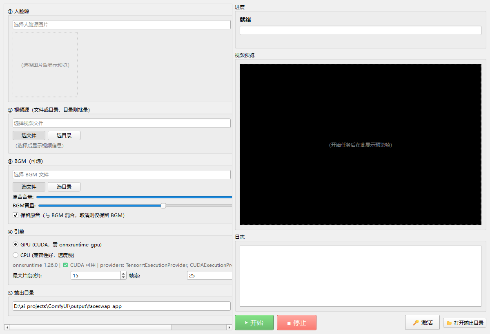
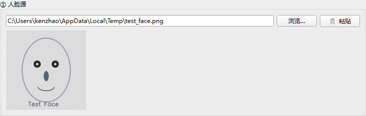
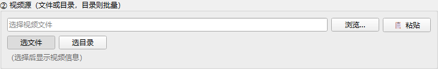
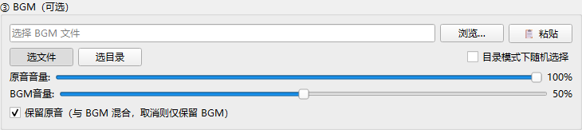
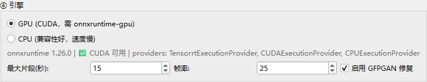
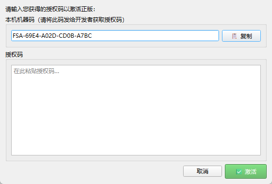

# 视频换脸客户端 使用说明书

> 版本：1.0.0 ｜ 适用平台：Windows 10/11 64 位

---

## 目录

1. [产品简介](#1-产品简介)
2. [系统要求](#2-系统要求)
3. [安装步骤](#3-安装步骤)
4. [运行环境说明](#4-运行环境说明)
5. [界面介绍](#5-界面介绍)
6. [使用步骤](#6-使用步骤)
7. [体验版与激活](#7-体验版与激活)
8. [常见问题 FAQ](#8-常见问题-faq)
9. [输出说明](#9-输出说明)

---

## 1. 产品简介

**视频换脸客户端**是一款基于 InsightFace + ONNX Runtime 的桌面端视频换脸工具，支持将指定人脸图片替换到视频中的人物面部，并可混入背景音乐（BGM），提供 GPU 加速与 CPU 兼容两种运行模式。

### 核心功能

| 功能 | 说明 |
|------|------|
| 🎭 **视频换脸** | 将人脸源图片中的面部替换到视频中的每一帧人物上 |
| 📁 **批量处理** | 支持选择视频目录，自动批量处理目录下所有视频 |
| 🎵 **BGM 混音** | 为换脸后的视频添加背景音乐，支持原音/BGM 音量独立调节、BGM 自动循环 |
| ✨ **画质增强** | 可选启用 GFPGAN 面部修复，提升换脸区域清晰度 |
| 📺 **流式预览** | 处理过程中实时显示已换脸的帧画面，无需等待完成即可预览效果 |
| 🆓 **体验版** | 免费体验 3 次完整换脸任务，满意后可购买永久授权 |

---

## 2. 系统要求

### 操作系统

- **Windows 10 / Windows 11**（64 位）

### 硬件要求

| 项目 | GPU 版 | CPU 版 |
|------|--------|--------|
| 显卡 | NVIDIA 显卡，驱动版本 ≥ 537.x，显存建议 ≥ 4GB | 无显卡要求 |
| CPU | 无特殊要求 | 4 核以上 |
| 内存 | ≥ 8GB | ≥ 8GB |
| 磁盘 | ≥ 8GB（含模型和临时文件） | ≥ 8GB |

### 软件依赖

- **VC++ 2015-2022 Redistributable (x64)**：程序运行必需，安装包内已附带 `VC_redist.x64.exe`
  - 下载链接：https://aka.ms/vs/17/release/vc_redist.x64.exe
  - 如安装包内已有，可直接运行安装

---

## 3. 安装步骤

### 步骤 1：解压安装包

将收到的压缩包（如 `FaceswapApp_gpu_setup.exe` 或 `FaceswapApp_gpu.zip`）解压到任意目录，例如：

```
D:\FaceswapApp_gpu\
```

### 步骤 2：了解目录结构

解压后的目录结构如下：

```
FaceswapApp_gpu/                  （或 FaceswapApp_cpu/）
├── FaceswapApp_gpu.exe           ← 主程序（双击运行）
├── ffmpeg.exe                    ← 视频处理工具
├── ffprobe.exe                   ← 视频信息探测工具
├── _internal/                    ← Python 运行时和依赖库
│   ├── PySide6/                  ← GUI 框架
│   ├── torch/                    ← 深度学习框架
│   ├── cv2/                      ← OpenCV 图像处理
│   └── ...
└── models/                       ← 模型文件目录（如已打包）
    ├── insightface/
    │   └── inswapper_128.onnx    ← 换脸模型（必需）
    └── facerestore_models/
        └── GFPGANv1.4.pth        ← 面部修复模型（可选）
```

### 步骤 3：确认模型文件

换脸功能依赖以下模型文件，请确认它们存在：

| 模型 | 路径 | 必需性 |
|------|------|--------|
| inswapper_128.onnx | `models/insightface/inswapper_128.onnx` | ✅ 必需 |
| GFPGANv1.4.pth | `models/facerestore_models/GFPGANv1.4.pth` | ⚪ 可选（不影响换脸，仅画质增强不可用） |

> 💡 如果模型文件不在 exe 同级的 `models/` 目录下，程序也会自动在上级目录查找。

### 步骤 4：安装 VC++ 运行时（如尚未安装）

如果程序无法启动，提示缺少 DLL 文件，请安装 VC++ Redistributable：

1. 双击安装包内的 `VC_redist.x64.exe`
2. 或从微软官网下载：https://aka.ms/vs/17/release/vc_redist.x64.exe
3. 安装完成后重新运行主程序

### 步骤 5：首次运行

双击 `FaceswapApp_gpu.exe`（或 `FaceswapApp_cpu.exe`）启动程序。首次启动时：

- 程序会检测 GPU / onnxruntime 环境
- 窗口标题栏显示授权状态：`视频换脸客户端 - 体验版（剩余 3/3 次）`
- 界面加载完成后即可开始使用

---

## 4. 运行环境说明

### GPU 版 vs CPU 版

| 对比项 | GPU 版 (FaceswapApp_gpu) | CPU 版 (FaceswapApp_cpu) |
|--------|--------------------------|--------------------------|
| 加速方式 | NVIDIA CUDA | 纯 CPU 计算 |
| 处理速度 | 约 2 帧/秒 | 约 0.2 帧/秒 |
| 硬件要求 | NVIDIA 显卡 + CUDA | 无特殊要求 |
| 兼容性 | 仅 N 卡 | 所有电脑 |
| onnxruntime | onnxruntime-gpu | onnxruntime |

### 如何选择版本

- **有 NVIDIA 显卡** → 使用 **GPU 版**（速度快 10 倍左右）
- **无 NVIDIA 显卡 / 集成显卡 / AMD 显卡** → 使用 **CPU 版**

### 首次启动说明

首次启动时，程序会进行以下初始化（约 10-30 秒）：

1. **加载 InsightFace 人脸分析模型**（buffalo_l）
2. **加载换脸模型**（inswapper_128.onnx）
3. **加载面部修复模型**（GFPGANv1.4.pth，如启用）
4. **检测 GPU 环境**：检查 onnxruntime 是否支持 CUDA

> ⏳ 初始化完成后，日志区会显示 `模型就绪`，之后即可开始换脸任务。

---

## 5. 界面介绍

### 整体布局

程序主界面采用 **左右分栏** 布局：左侧为参数设置区（可滚动），右侧为进度/预览/日志/操作区。



### 左侧参数区

#### ① 人脸源

选择一张包含清晰人脸的图片作为换脸源。选择图片后，下方会显示 160×160 的预览图。



- **浏览…**：弹出文件选择对话框，支持格式：PNG / JPG / JPEG / BMP / WEBP
- **📋 粘贴**：从剪贴板粘贴图片路径（方便从资源管理器复制路径后直接粘贴）

#### ② 视频源

选择要换脸的视频文件或视频目录（目录模式为批量处理）。



- **选文件**：选择单个视频文件，支持格式：MP4 / AVI / MOV / MKV / FLV / WEBM
- **选目录**：选择一个目录，自动处理其中所有视频文件
- 选择后下方显示视频信息：时长、帧率、分辨率（如 `15.0s | 25.0fps | 1920x1080`）

#### ③ BGM（可选）

为换脸后的视频添加背景音乐。



- **选文件 / 选目录**：选择 BGM 文件或目录（目录模式可选随机播放），支持格式：MP3 / WAV / AAC / M4A / FLAC / OGG
- **目录模式下随机选择**：勾选后从目录中随机选取一首 BGM
- **原音音量**：滑块控制视频原声音量（0-100%，默认 100%）
- **BGM 音量**：滑块控制背景音乐音量（0-100%，默认 50%）
- **保留原音**：勾选后原音与 BGM 混合输出；取消勾选则仅保留 BGM（替换原音）

> 💡 BGM 时长不足时会自动循环播放，直到视频结束。

#### ④ 引擎

选择计算引擎和高级参数。



- **GPU (CUDA)**：使用 NVIDIA 显卡加速（需 onnxruntime-gpu + CUDA 支持）
- **CPU**：使用 CPU 计算（兼容性好，速度慢）
- 引擎下方显示 onnxruntime 检测结果（如 `✅ CUDA 可用` 或 `⚠️ CUDA 不可用`）

**高级参数：**

| 参数 | 范围 | 默认值 | 说明 |
|------|------|--------|------|
| 最大片段(秒) | 5 - 120 | 15 | 视频分段处理的最大时长，分段越小内存占用越低 |
| 帧率 | 1 - 60 | 25 | 输出视频帧率（取原始帧率与此值的较大值） |
| 启用 GFPGAN 修复 | 开/关 | 开 | 面部画质增强，提升换脸区域清晰度 |

#### ⑤ 输出目录

选择换脸结果视频的保存目录。默认为程序工作目录下的 `output/faceswap_app/`。

### 右侧操作区

| 区域 | 说明 |
|------|------|
| **进度** | 显示当前阶段（初始化/分段/换帧/合并/混音/完成）、进度条和帧数统计 |
| **视频预览** | 处理过程中实时显示已换脸的帧画面（流式预览） |
| **日志** | 显示详细处理日志，包括帧率、剩余时间等 |
| **▶ 开始** | 绿色按钮，启动换脸任务 |
| **■ 停止** | 红色按钮，停止正在运行的任务（等待当前片段完成后退出） |
| **🔑 激活** | 打开激活对话框，输入授权码激活正版 |
| **📂 打开输出目录** | 在资源管理器中打开输出目录 |

---

## 6. 使用步骤

### 步骤 1：选择人脸源图片

1. 在 **① 人脸源** 区域，点击 **浏览…** 按钮
2. 在文件选择对话框中选取一张清晰的人脸图片
3. 选取后下方预览区会显示人脸图片

> ⚠️ **注意事项**：源图片需为清晰正脸，光线均匀，面部无遮挡。模糊、侧脸或遮挡的图片可能导致换脸失败。


> 💡 也可以从资源管理器复制图片路径，点击 **📋 粘贴** 按钮直接填入路径。

### 步骤 2：选择视频源

1. 在 **② 视频源** 区域，根据需要选择模式：
   - 点击 **选文件**：处理单个视频文件
   - 点击 **选目录**：批量处理目录下所有视频
2. 选择后下方会显示视频信息（时长、帧率、分辨率）


### 步骤 3：选择 BGM（可选）

1. 在 **③ BGM** 区域，选择 BGM 文件或目录
2. 如果不需要 BGM，可跳过此步


### 步骤 4：调整音量

根据需要调节音量滑块：

- **原音音量**：控制视频原始音轨的音量（0-100%）
- **BGM 音量**：控制背景音乐的音量（0-100%）
- **保留原音**：勾选表示原音与 BGM 混合；取消勾选则仅保留 BGM

> 💡 常见搭配：保留原音 + BGM 音量 50% = 画中画式音频体验。

### 步骤 5：选择引擎和高级参数

1. 在 **④ 引擎** 区域选择 **GPU** 或 **CPU**（如有 N 卡建议选 GPU）
2. 根据需要调整高级参数：
   - **最大片段(秒)**：一般保持默认 15 秒即可；视频较长或显存不足时可调小
   - **帧率**：一般保持默认 25 即可
   - **启用 GFPGAN 修复**：建议勾选以获得更好的面部画质


### 步骤 6：选择输出目录

1. 在 **⑤ 输出目录** 区域，点击 **浏览…** 按钮
2. 选择一个用于保存输出视频的目录
3. 默认路径为 `output/faceswap_app/`，可直接使用

### 步骤 7：点击"开始"

1. 确认所有参数无误后，点击绿色 **▶ 开始** 按钮
2. 日志区会显示任务信息：人脸源、视频源、BGM、引擎等
3. 进度区显示当前阶段和进度条
4. 视频预览区会实时显示已换脸的帧画面

> 📷 此处为运行中的流式预览截图
>
> 处理过程中，预览区会每隔几帧刷新显示最新换脸结果，进度条显示当前帧数/总帧数及处理速度（帧/秒）和预计剩余时间。

**处理阶段说明：**

| 阶段 | 说明 |
|------|------|
| `init` | 初始化模型、检测源人脸 |
| `split` | 视频分段、提取帧 |
| `frame` | 逐帧换脸处理（主要耗时阶段） |
| `preview` | 流式预览帧（不显示在进度条） |
| `merge` | 合并各段换脸结果 |
| `audio` | 混音 BGM |
| `done` | 任务完成 |

### 步骤 8：查看输出

1. 任务完成后，会弹出提示框显示成功/失败数量
2. 点击 **📂 打开输出目录** 按钮查看输出文件
3. 输出文件命名格式为：`{视频名}_{人脸名}_{时间戳}.mp4`

> ✅ 完成后预览区会显示 `✅ 处理完成（成功 N 个）` 提示。

---

## 7. 体验版与激活

### 体验版限制

- 免费体验 **3 次** 完整换脸任务
- 每成功完成 1 个视频换脸，计数 +1
- 计数达到 3 次后，需激活才能继续使用

### 查看剩余次数

程序标题栏会实时显示剩余体验次数：

```
视频换脸客户端 - 体验版（剩余 3/3 次）
视频换脸客户端 - 体验版（剩余 2/3 次）
视频换脸客户端 - 体验版（剩余 1/3 次）
```

### 如何激活

1. 点击界面上的 **🔑 激活** 按钮
2. 在弹出的激活对话框中，找到 **本机机器码** 区域
3. 点击 **📋 复制** 按钮复制机器码（格式：`FSA-XXXX-XXXX-XXXX`）
4. 将机器码发送给卖家，购买授权码（license key）
5. 将收到的授权码粘贴到 **授权码** 输入框
6. 点击 **✅ 激活** 按钮



### 激活后

- 标题栏变为 `视频换脸客户端 - 已授权`
- 永久使用，无次数限制
- 授权绑定单台电脑（基于 CPU ID + 主板序列号 + 硬盘序列号生成机器码）

> ⚠️ **注意**：机器码与硬件绑定，更换电脑需联系卖家重新授权。

---

## 8. 常见问题 FAQ

### Q: 打不开程序 / 提示缺少 DLL？

**A:** 请安装 VC++ 2015-2022 Redistributable (x64)：
- 安装包内附带的 `VC_redist.x64.exe`
- 或从微软官网下载：https://aka.ms/vs/17/release/vc_redist.x64.exe

### Q: GPU 版提示 CUDA 不可用？

**A:** 可能原因及解决方案：
1. **显卡驱动过旧** → 更新 NVIDIA 显卡驱动至 537.x 或以上
2. **CUDA / cuDNN 未正确安装** → 更新驱动后重试，或直接使用 CPU 版
3. **非 NVIDIA 显卡** → GPU 版仅支持 NVIDIA 显卡，AMD/集成显卡请使用 CPU 版

> 程序会在启动时自动检测，如果 CUDA 不可用会自动切换到 CPU 模式。

### Q: 速度很慢？

**A:** 这是正常现象：
- **GPU 模式**：约 2 帧/秒（1 分钟视频约需 12-15 分钟）
- **CPU 模式**：约 0.2 帧/秒（1 分钟视频约需 2-2.5 小时）
- 如有 N 卡，请优先使用 GPU 版以获得 10 倍加速

### Q: 换脸失败 / 提示未检测到人脸？

**A:** 请检查：
- 源图片需为 **清晰正脸**，面部占比不宜过小
- 避免使用模糊、侧脸、遮挡的图片
- 光线过暗或过曝可能导致检测失败
- 视频中无人脸的帧会原样保留（不影响其他帧）

### Q: GFPGAN 加载失败？

**A:** 不影响换脸功能，仅画质增强不可用：
- GFPGAN 是可选的面部修复模型
- 加载失败时程序会自动忽略，换脸功能正常使用
- 如需启用，请确认 `models/facerestore_models/GFPGANv1.4.pth` 文件存在

### Q: 激活后换电脑怎么办？

**A:** 机器码绑定硬件（CPU + 主板 + 硬盘），更换电脑后机器码会变化：
- 请联系卖家，提供新电脑的机器码，重新获取授权码
- 原授权码仅对原电脑有效

### Q: 支持哪些视频格式？

**A:** 支持以下视频格式：
- MP4 / AVI / MOV / MKV / FLV / WEBM

### Q: 支持哪些图片格式？

**A:** 支持以下图片格式（作为人脸源）：
- PNG / JPG / JPEG / BMP / WEBP

### Q: 支持哪些音频格式？

**A:** 支持以下音频格式（作为 BGM）：
- MP3 / WAV / AAC / M4A / FLAC / OGG

### Q: 任务运行中可以停止吗？

**A:** 可以。点击红色 **■ 停止** 按钮，程序会在当前片段处理完成后安全退出。已处理的部分不会保存。

### Q: 批量处理时如何查看进度？

**A:** 日志区会显示当前处理的视频序号（如 `任务 2/5: video_name.mp4`），进度条显示当前视频的处理进度。

---

## 9. 输出说明

### 输出文件命名规则

输出文件按以下格式命名：

```
{视频名}_{人脸名}_{时间戳}.mp4
```

例如：
- 视频：`dance.mp4`
- 人脸源：`star.png`
- 时间：2026-07-09 16:30:00

则输出文件名为：`dance_star_20260709_163000.mp4`

### 输出位置

- 默认输出目录：`output/faceswap_app/`（程序工作目录下）
- 可在 **⑤ 输出目录** 中自定义输出路径
- 处理完成后点击 **📂 打开输出目录** 可快速定位

### 视频格式

| 项目 | 规格 |
|------|------|
| 视频编码 | H.264 (libx264) |
| 音频编码 | AAC |
| 像素格式 | YUV420p |
| 容器格式 | MP4 |
| 帧率 | 取原始帧率与设定帧率的较大值 |

---

> 📧 如有任何问题，请联系卖家获取技术支持。
>
> © FaceswapApp 1.0.0
